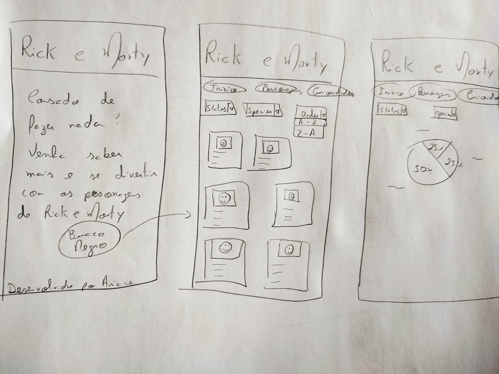

# Data Lovers 🌟🧬 Rick e Morty 🪐
Segundo projeto da turma SAP008 da Laboratoria - https://arianecmachado.github.io/SAP008-data-lovers/

## 🚀 *Introdução*

Durante a época de Halloween na Escola de Idiomas X, os alunos participam de uma gincana. Neste ano os alunos irão competir em equipes com quiz sobre os personagens de Rick e Morty. Para isso, precisarão de um local que tenha as informações para responderem as perguntas sobre personagens. Este projeto tem a intenção de criar um site que possa ser acessado por computador ou celular, e assim que eles consigam todas as informações necessárias para participar da gincana.
Este projeto está sendo criado em função de como os alunos precisam dele para participar da gincana de Halloween.

## 📋 *Histórias de usuário*
1. Eu, como aluno/visitante quero ter acesso as informações sobre os personagens da Série Rick e Morty.
2. Eu, como aluno/visitante preciso ordenar os personagens por ordem afabetica (A-Z).
3. Eu, como aluno/visitante preciso filtrar os personagens por 'Status' e 'Species'
4. Eu, como aluno/visitante quero saber números de porcentagens a respeito dos personagens.

### 🎯 *Critérios de aceite*
Deverá ter um menu onde o visitante possa percorrer todas as páginas com facilidade.
Deverá ter ordenação por ordem alfábetica (A-Z) e (Z-A).
Deverá ter filtro pelo por 'Status' e 'Species'.

## 🖼️ *Protótipos*
Primeiro, foi criado um protótipo de baixa fidelidade onde foi desenvolvido e pensado o que este website deveria ter para corresponder as necessidades do cliente que solicitou o projeto. Em segui o protótipo de alta fidelidade para que possa ser testadas as funcionalidades e usabilidades do usuário.

### Protótipo de baixa fidelidade
Utilizando lápis e papel foi-se criado um rascunho da ideia para o projeto.

**Protótipo de baixa fidelidade**


### Protótipo de alta fidelidade
E segundo passo, um protótipo de alta fidelidade para que o cliente tivesse uma noção melhor de como ficaria e pudesse sugerir as modificações necessárias.

**Protótipo de alta fidelidade para Desktop**


**Protótipo de alta fidelidade para Celular**


### Usabilidade
Depois de enviado o protótipo para várias pessoas testarem a usabilidade do projeto. (5 ao total)
Foi percebido que alguns erros ortográficos e a falta de um botão para voltar ao menu inicial. E alterado para chegar ao protótipo final.

## 🔧 Passo a passo 
Com o HTML básico, foi escrito o CSS básico.
E assim o JS foi realizado encima dos obrjetivos de aprendizagem para realizar a:

###Ordenação
```
const printAZOrdered =()=>{
  const orderAZ = selectOrderAZ.value
  const resultAZ = sortCharacters(characters,orderAZ)
```

###Filtro
```
const printGenderFiltered =()=>{
  const gender = selectGenders.value
  const resultGender = filterGender(characters, gender)
```

###Cálculo agregado
```
 const parcial = resultGender.length
  const resultCalculo = CalAgregado(characters.length,parcial)
  document.getElementById("mensagem").innerHTML= "This category represents " +resultCalculo+ " % of the characters"
```


## 🔩 Teste

Os tests verificam a funcionalidade do projeto.

### Verificando a ordenação

```
  it('should return Albert,Beth, Jerry, Morty, Ricky, Sam for Ricky, Sam, Morty, Albert, Beth, Jerry with order=="A-Z"', () => {
    expect(sortCharacters(characters, "A-Z")).toStrictEqual([
  it('should return Sam, Ricky, Morty, Jerry, Beth. Albert for Ricky, Sam, Morty, Albert, Beth, Jerry  with order=="Z-A"', () => {
    expect(sortCharacters(characters, "Z-A")).toStrictEqual([
```

### Verificando os filtros

```
  it('should return Sam e Beth for characters with genders=="female"', () => {
    expect(filterGender(characters, "Female")).toStrictEqual([
  
  it('should return Ricky,Sam, Morty, Albert, Beth, Jerry for characters with Specie=="human"', () => {
    expect(filterSpecie(characters, "Human")).toStrictEqual([
    
  it('should return Ricky, Sam, Morty e Beth for characters with Status=="alive"', () => {
    expect(filterStatu(characters, "Alive")).toStrictEqual([
```

### Verificando o cálculo agregado

```
it('should return 50%', () => {
    expect(CalAgregado(10, 5)).toEqual(50);
  });
```

## ✒️ Autora

Projeto realizado por Ariane Costa Machado. Com grande ajuda de todo o pessoal da Laboratoria.
